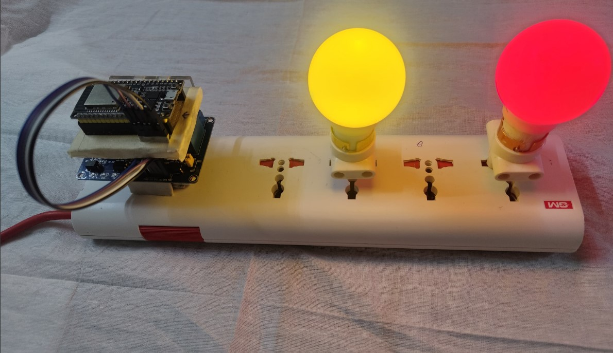
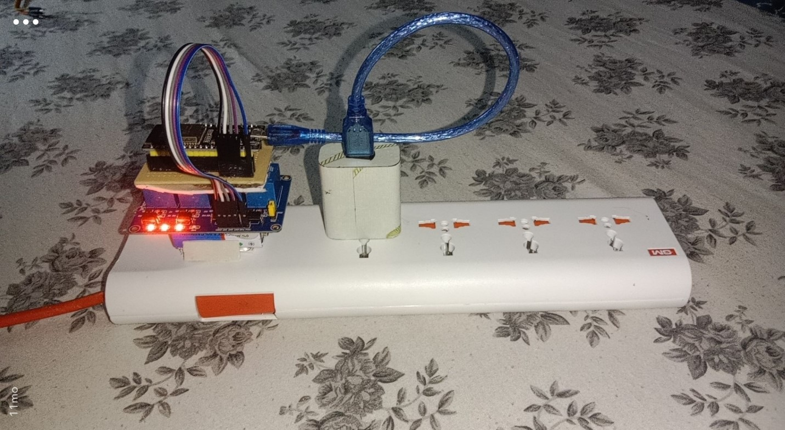
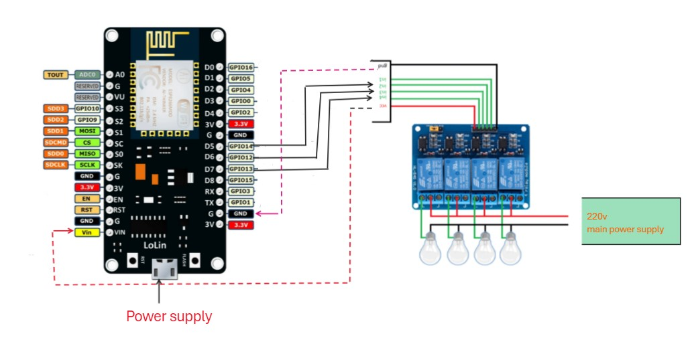
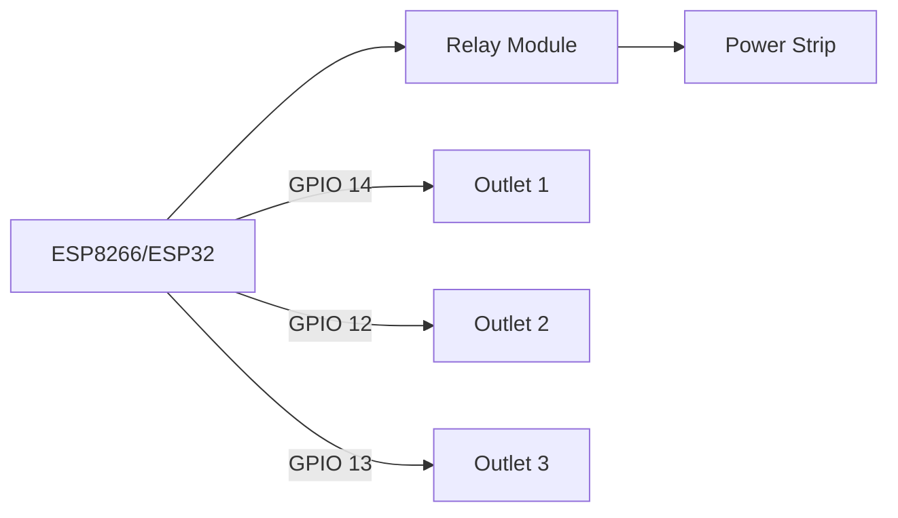

<div align="center">
   
# 🌟 Smart Home Power Box. 
### Control Your World with Voice and Touch 🎮


[](https://opensource.org/licenses/MIT)
[](https://www.arduino.cc/)
[](https://www.espressif.com/)
[](https://alexa.amazon.com/)

<p align="center"> 
  
</p>

*Transform your ordinary power strip into a smart home powerhouse with voice control and mobile app integration!* 🚀

  [Report Bug](https://github.com/ankush2992/smart-power-hub/issues) · [Request Feature](https://github.com/ankush2992/smart-power-hub/issues)

</div>

## ✨ Features

- 🎯 **Precise Control** - Manage 3 independent AC outlets with millisecond precision
- 🌐 **WiFi Enabled** - Connect to your home network with auto-reconnect capability
- 🗣️ **Voice Control** - Compatible with Alexa and Google Assistant through SinricPro
- 📱 **Mobile App** - Control from anywhere using the SinricPro mobile app and inbuilt Google-Home device manager
- ⚡ **Real-time Updates** - Instant status feedback and power state monitoring
- 🔐 **Secure** - Encrypted communication and secure cloud connectivity  .

<div align="center">

<p><b>Project Setup in Action</b></p>


<p><b>Final Assembled Device</b></p>
</div>
## 🛠️ Hardware Requirements

### Components Needed
- ESP8266 or ESP32 development board
- 3-channel relay module (5V)
- Power strip or extension board
- Jumper wires
- 5V power supply
- Basic tools for assembly

<div align="center">

<p><b>Project Components</b></p>

## 🔧 Installation

### 1️⃣ Hardware Setup


### 2️⃣ Software Setup

1. Install required libraries:
```bash
# Using Arduino Library Manager
🔍 Search for "SinricPro"
✅ Install "SinricPro by Boris Jaeger"
```

2. Configure credentials:
```cpp
#define WIFI_SSID    "Your_WiFi_SSID"
#define WIFI_PASS    "Your_WiFi_Password"
#define APP_KEY      "Your_APP_KEY"
#define APP_SECRET   "Your_APP_SECRET"
```

## 📱 Usage

1. **Power up** - Connect the device to power
2. **Connect** - Wait for WiFi connection (LED will turn solid)
3. **Control** - Use any of these methods:
   - 🗣️ Voice commands through Alexa/Google Assistant
   - 📱 SinricPro mobile app
   - 🌐 Web dashboard

## 🔌 Pin Configuration

| Component | GPIO Pin | Description |
|-----------|----------|-------------|
| Relay 1   | GPIO 14  | Main outlet control |
| Relay 2   | GPIO 12  | Secondary outlet |
| Relay 3   | GPIO 13  | Auxiliary outlet |

## ⚠️ Safety First!

```diff
+ Always ensure proper insulation
- Never work with live AC power
! Consult an expert when in doubt
```

## 🤝 Contributing

Contributions make the open-source community amazing! Any contributions you make are **greatly appreciated**.

1. Fork the Project
2. Create your Feature Branch (`git checkout -b feature/AmazingFeature`)
3. Commit your Changes (`git commit -m 'Add some AmazingFeature'`)
4. Push to the Branch (`git push origin feature/AmazingFeature`)
5. Open a Pull Request

## 📜 License

Distributed under the MIT License. See `LICENSE` for more information.

## 📞 Support

Having troubles? We're here to help!

- 📧 Email - xen2992on@gmail.com

## 🌟 Show your support

Give a ⭐️ if this project helped you!

<div align="center">

Made with ❤️ by [ANKUSH](https://github.com/ankush2992)

</div>
